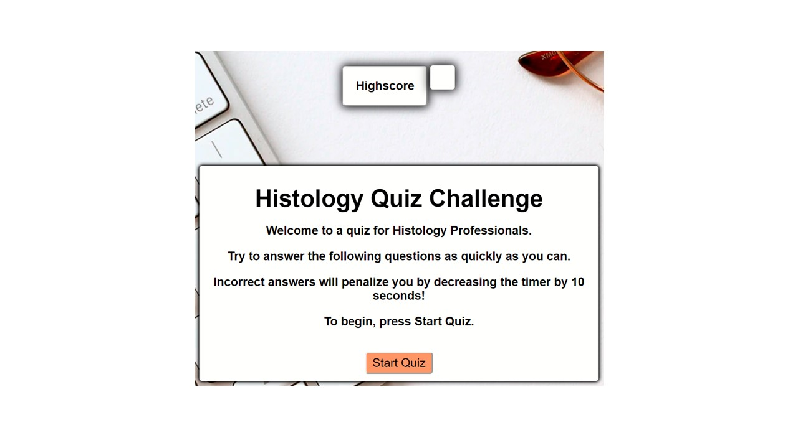
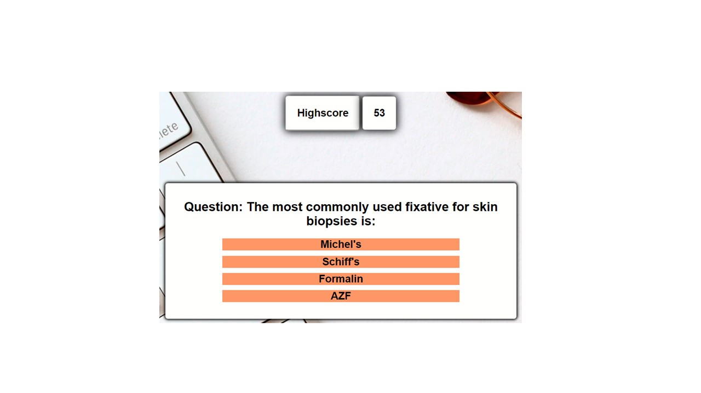
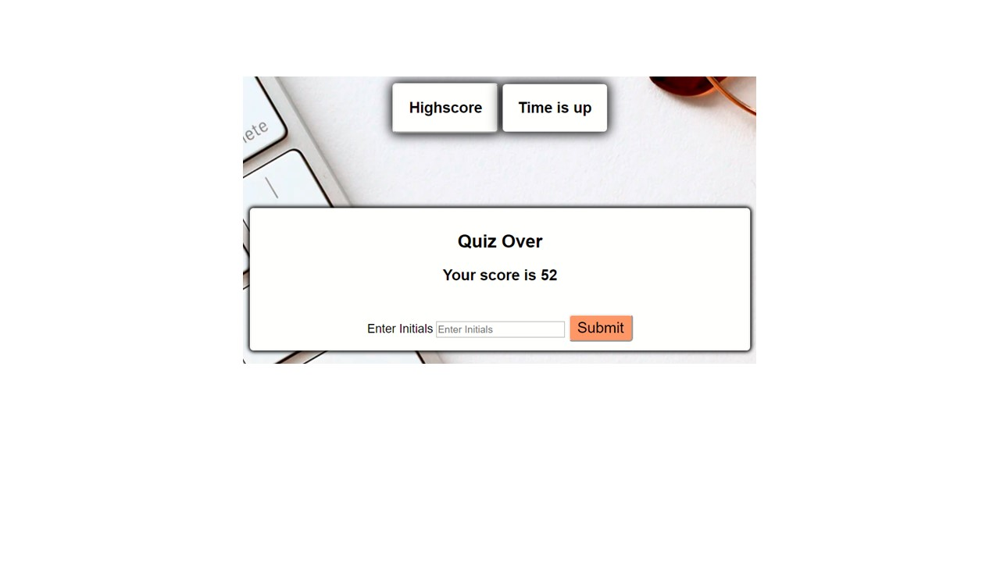
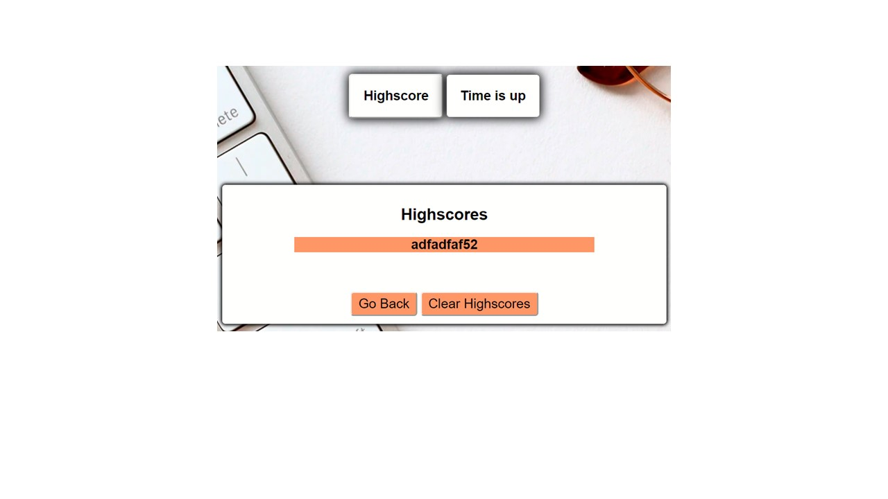

# CODE QUIZ

## Introduction

As a student who is just beginning their coding experience by taking a web development bootcamp, I wanted to build a timed quiz that could test my knowledge in my current career. 
As a registered Histology Technician I am required by CLIA, a federal inspection agency for labs, to take a yearly competency to assess my knowledge pertaining to the Mohs / Histology field.  This online quiz would be a fun way to fulfill this requirement.

## Features
 The object of this quiz challenge is to answer all 5 questions as fast as you can.
 The following steps outline what the user can expect from this quiz.

 1. When the user clicks the "Start Quiz" button, the quiz is initiated.  
 2. A question appears on the next screen along with a countdown timer.  
    * The user begins with 75 seconds to finish all 5 questions.
    * The selection of an incorrect answer results in a 15 second time loss penalty.
 3. At the end of the quiz the user is shown their score
    * Their initials can be entered and stored along with the remainder of the time left on the timer.
    * If the user continues to play, they can monitor their progression towards a faster time.

 ## Credit
To style the container boxes with shadowing, I used the styling suggested by Web Dev Simplified on youTube episode "Build A Quiz App with Javascript"

The code for the timer was provided by w3schools.com.

## Preview

1. Begin quiz

2. Preview of questions with timer

3. End of Quiz

4. Highscores

# Badges

